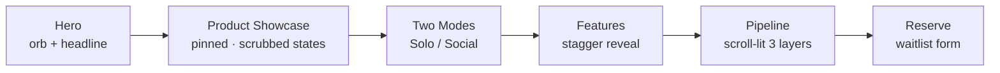
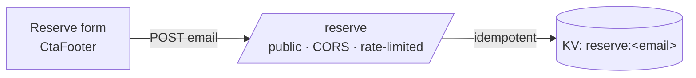

<div align="center">

# Auris — Website

### The marketing site for the always-on AI pendant.

*A software company. It happens to make jewelry.*

<!-- Drop a hero/OG image at public/og.png and it will render here -->


</div>

---

## What this is

A single, knockout landing page for **Auris** — the wearable AI pendant that listens,
sees, and thinks. It is built to a *fieldy.ai-grade* bar: gliding momentum scroll and
scroll-driven animation, wrapped in Auris's own visual identity.

It is a standalone subproject (`web/`) inside the Auris monorepo, separate from the
React Native app (`app/`) and the Cloudflare backend (`backend/`) — its own dependency
tree, its own deploy target (Vercel).

> **The full build story** — what was built, how, and why — lives in the
> [build journal](docs/sessions/). Start with
> [00 — Foundation & Design System](docs/sessions/00-foundation-and-design-system.md).

---

## The feel: warm luminous dark

The art direction is a single, disciplined idea. A **near-black** canvas, a **warm gold**
accent used sparingly, and one signature motif: **concentric gold sound-rings radiating
from a single orb** — the exact identity of the in-app orb, now the brand's language on
the web. Generous negative space, large quiet type, gold only where it earns attention.

| Token | Value | Use |
|---|---|---|
| `base` | `#0A0A0B` | the canvas |
| `panel` | `#141416` | elevated surfaces |
| `gold` | `#E8B84B` | the accent |
| `glow` | `#FFD98A` | highlights, gradients |
| `fg` / `muted` | `#F5F5F0` / `#9A9A92` | text |

All of it lives as Tailwind v4 `@theme` tokens in [`app/globals.css`](app/globals.css) —
there is **no `tailwind.config.ts`**.

---

## The one idea: scroll as narrative

A flat marketing page lists features. Auris's page **tells the product as you scroll.**

The centerpiece — `ProductShowcase` — **pins** in place while a `+=300%` scroll distance
is **scrubbed** into the pendant's real state machine: **idle → listening → thinking →
speaking**. The orb's glow, ring count, and narration change with your scroll position.
You don't read about the pendant working; you scroll it to life.



Everything respects `prefers-reduced-motion`: smooth scroll and the scrub are disabled,
the pulses freeze, and every word stays readable.

---

## Stack — and why each piece exists

The smoothness is not one library; it is a deliberate toolset:

| Piece | Why it's here |
|---|---|
| **Next.js 16** (App Router, Turbopack) | base framework, static export, Vercel-native |
| **Tailwind CSS v4** | utilities + the whole design system via CSS `@theme` |
| **Lenis** | momentum (smooth) scrolling — the "gliding" feel |
| **GSAP + ScrollTrigger** | the pinned, scroll-scrubbed hero moment |
| **Framer Motion** | lighter reveal / stagger animations |
| **next/font** | Sora (display) + Inter (body) |

A single [`SmoothScroll`](components/SmoothScroll.tsx) provider runs **one** rAF loop —
driven by GSAP's ticker — that advances Lenis *and* updates ScrollTrigger, so scrubbed
scenes stay perfectly in lockstep with the smoothed scroll.

---

## Repository layout

```
web/
├── app/
│   ├── globals.css         # @theme design tokens + sound-ring keyframes + reduced-motion
│   ├── layout.tsx          # fonts, metadata/OG, <SmoothScroll> provider
│   └── page.tsx            # composes the sections
├── components/
│   ├── SmoothScroll.tsx    # Lenis ↔ GSAP ticker sync
│   ├── SoundRings.tsx      # the signature gold orb + radiating rings
│   ├── Pendant.tsx         # the pendant, rendered in SVG (engraved sound-rings)
│   ├── Nav.tsx             # transparent → frosted on scroll
│   └── sections/           # Hero · ProductShowcase · TwoModes · Features · Pipeline · CtaFooter
├── lib/
│   ├── gsap.ts             # registers ScrollTrigger + reduced-motion helper
│   └── reserve.ts          # waitlist API client
├── public/                 # static assets
└── docs/sessions/          # build journal (00–02 + index)
```

---

## Quickstart

Requires **Node 20+**.

```bash
npm install
npm run dev      # http://localhost:3000  (use --port 8083 to avoid the app's 8082)
npm run build    # production build — must pass clean
```

You can start editing from [`app/page.tsx`](app/page.tsx); the page hot-reloads as you save.

---

## The reserve waitlist

The primary CTA is a working waitlist with **zero new infrastructure** — it posts to a
public endpoint on the Cloudflare Worker the product already runs.



- Client: [`lib/reserve.ts`](lib/reserve.ts) → `POST { email, source }`. Override the URL
  with `NEXT_PUBLIC_RESERVE_URL` (defaults to the live Worker).
- Endpoint: **not** under `/v1/*` (so the public browser form needs no API key), email
  validated, **idempotent**, IP rate-limited, stored in KV under `reserve:<email>`.

Read the waitlist (from the backend project):

```bash
cd backend && nvm use 22 && node_modules/.bin/wrangler kv key list \
  --namespace-id=f56efb1edefc4d7496b4531faccb94f5 --prefix "reserve:" --remote
```

---

## Accessibility

- Full `prefers-reduced-motion` support — Lenis is skipped, the scrub is disabled, and the
  CSS pulses freeze, while all content stays visible.
- Semantic landmarks, labelled form controls, and gold-on-near-black contrast tuned for
  legibility over the glow.

---

## Deploy

Built for **Vercel** — zero config. Push the repo, point Vercel at `web/` as the project
root, set `NEXT_PUBLIC_RESERVE_URL` if you ever move the endpoint, and ship. `npm run build`
must pass first.

---

## Team

**Ahmet (Selim)** — engineering: site, design system, animation, backend wiring.
**Mete** — business, product, brand.
**Atilla** — AI research.

The development history, section by section, is in the **[build journal](docs/sessions/)**.
